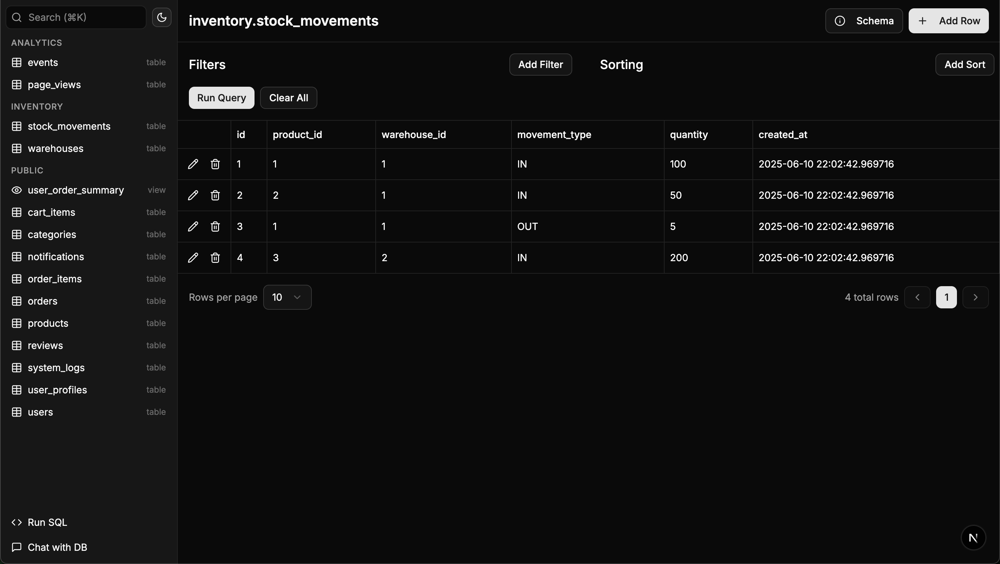
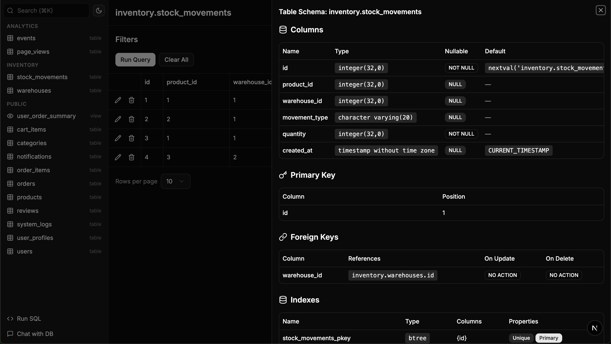
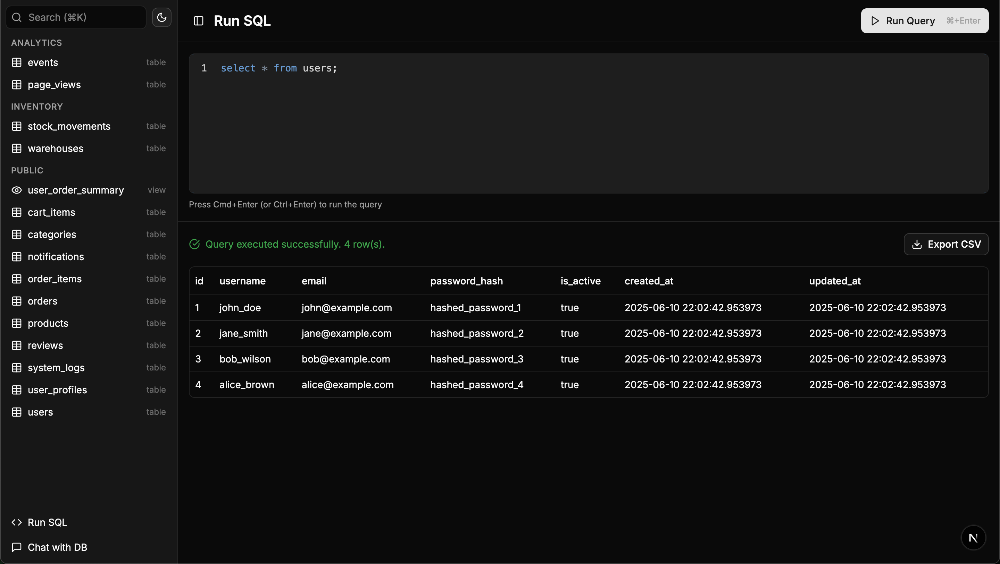
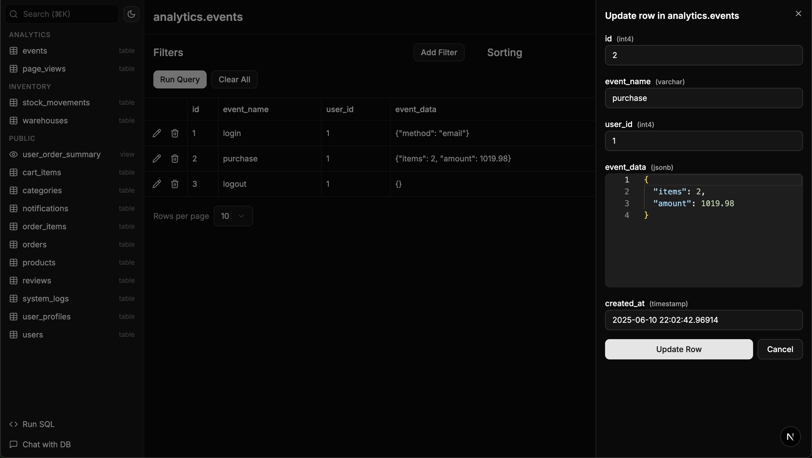

# Database Management UI

This is a modern, user-friendly self-hosted DB management web ui built with Next.js, TypeScript, and shadcn/ui. It provides a simpler and more elegant alternative to traditional database management tools like pgAdmin, phpMyAdmin, and SQL Server Management Studio.

## Supported Databases

- **PostgreSQL** - Full support for PostgreSQL databases
- **MySQL** - Complete MySQL database management
- **Microsoft SQL Server** - MSSQL database operations and management

## Features & Screenshots

### Database Operations

- **Full CRUD Operations**: Create, read, update, and delete records from your database tables. Has UI for filters/sorts with pagination.
- **Schema Introspection**: Automatically discover and visualize your database schema, including tables, columns, relationships, and constraints.
- **Custom SQL Queries**: Write and execute custom SQL queries with syntax highlighting and result visualization + exports to CSV.


_Browse and manage your database tables with an intuitive interface featuring sorting, filtering, and pagination._


_Automatically discover and visualize your database schema, including tables, columns, relationships, and constraints._


_Write and execute custom SQL queries with syntax highlighting and comprehensive result visualization._


_Edit database records directly in the interface with validation and real-time updates._

### Table Search

Quickly find and navigate to any table in your database with intelligent search capabilities.

- **Fuzzy Search**: The sidebar includes a fuzzy search bar that helps you quickly find tables
- **Keyboard Shortcuts**:
  - Press `Cmd+K` (Mac) or `Ctrl+K` (Windows/Linux) to focus the search bar
  - Press `Enter` to navigate to the first matching table
  - Press `Escape` to clear the search and unfocus
- **Real-time Filtering**: Tables are filtered as you type with intelligent fuzzy matching

### Chat with DB

Get intelligent assistance for your database operations with an AI-powered chat interface.

- **AI-Powered Database Assistant**: Interactive chat interface with an AI that knows your database schema
- **Schema-Aware Responses**: The AI has access to your complete database structure and can help with:
  - Understanding table relationships
  - Writing SQL queries
  - Database optimization suggestions
  - Data analysis insights
- **Real-time Streaming**: Responses are streamed in real-time for a smooth chat experience


_Interactive chat with an AI assistant that understands your database schema and can help with queries and optimization._

## Getting Started

## Docker Deployment

This application can also be deployed using Docker for consistent and portable deployments.

### Using Published Docker Image

The application is automatically published to GitHub Container Registry. To use the published image:

```bash
docker pull ghcr.io/n7olkachev/db-ui:latest
```

### Quick Start with Docker Run

**For PostgreSQL**:

```bash
docker run -d \
  --name db-ui-app \
  -p 3000:3000 \
  -e POSTGRES_HOST=your_database_host \
  -e POSTGRES_USER=your_username \
  -e POSTGRES_PASSWORD=your_password \
  -e POSTGRES_DB=your_database \
  -e POSTGRES_PORT=5432 \
  -e GROQ_API_KEY=your_groq_api_key \
  -e GROQ_MODEL=llama-3.1-70b-versatile \
  ghcr.io/n7olkachev/db-ui:latest
```

**For MySQL**:

```bash
docker run -d \
  --name db-ui-app \
  -p 3000:3000 \
  -e MYSQL_HOST=your_database_host \
  -e MYSQL_USER=your_username \
  -e MYSQL_PASSWORD=your_password \
  -e MYSQL_DB=your_database \
  -e MYSQL_PORT=3306 \
  -e GROQ_API_KEY=your_groq_api_key \
  -e GROQ_MODEL=llama-3.1-70b-versatile \
  ghcr.io/n7olkachev/db-ui:latest
```

**For Microsoft SQL Server**:

```bash
docker run -d \
  --name db-ui-app \
  -p 3000:3000 \
  -e MSSQL_HOST=your_database_host \
  -e MSSQL_USER=your_username \
  -e MSSQL_PASSWORD=your_password \
  -e MSSQL_DB=your_database \
  -e MSSQL_PORT=1433 \
  -e GROQ_API_KEY=your_groq_api_key \
  -e GROQ_MODEL=llama-3.1-70b-versatile \
  ghcr.io/n7olkachev/db-ui:latest
```

Replace the database connection details and `your_groq_api_key` with your actual values.

### Building and Running from Source

1. **Build the Docker Image**:

   ```bash
   docker build -t db-ui .
   ```

2. **Run the Built Image**:

   For PostgreSQL:

   ```bash
   docker run -d \
     --name db-ui-app \
     -p 3000:3000 \
     -e POSTGRES_HOST=your_database_host \
     -e POSTGRES_USER=your_username \
     -e POSTGRES_PASSWORD=your_password \
     -e POSTGRES_DB=your_database \
     -e POSTGRES_PORT=5432 \
     -e GROQ_API_KEY=your_groq_api_key \
     -e GROQ_MODEL=llama-3.1-70b-versatile \
     db-ui
   ```

   For MySQL:

   ```bash
   docker run -d \
     --name db-ui-app \
     -p 3000:3000 \
     -e MYSQL_HOST=your_database_host \
     -e MYSQL_USER=your_username \
     -e MYSQL_PASSWORD=your_password \
     -e MYSQL_DB=your_database \
     -e MYSQL_PORT=3306 \
     -e GROQ_API_KEY=your_groq_api_key \
     -e GROQ_MODEL=llama-3.1-70b-versatile \
     db-ui
   ```

   For Microsoft SQL Server:

   ```bash
   docker run -d \
     --name db-ui-app \
     -p 3000:3000 \
     -e MSSQL_HOST=your_database_host \
     -e MSSQL_USER=your_username \
     -e MSSQL_PASSWORD=your_password \
     -e MSSQL_DB=your_database \
     -e MSSQL_PORT=1433 \
     -e GROQ_API_KEY=your_groq_api_key \
     -e GROQ_MODEL=llama-3.1-70b-versatile \
     db-ui
   ```

### Running from source

- Node.js 18+
- npm, yarn, pnpm
- One of the supported databases:
  - PostgreSQL database (local or remote)
  - MySQL database (local or remote)
  - Microsoft SQL Server database (local or remote)

### Building for Production

1. **Build the Application**:

   ```bash
   npm run build
   # or
   yarn build
   # or
   pnpm build
   ```

2. **Start the Production Server**:
   ```bash
   npm start
   # or
   yarn start
   # or
   pnpm start
   ```

The application will be available at [http://localhost:3000](http://localhost:3000).

### Environment Setup

Choose the appropriate environment template for your database and copy it to `.env`:

**For PostgreSQL:**

```bash
cp env.postgresql .env
```

Example PostgreSQL configuration:

```env
POSTGRES_HOST=localhost
POSTGRES_PORT=5432
POSTGRES_DB=sampledb
POSTGRES_USER=admin
POSTGRES_PASSWORD=admin
```

**For MySQL:**

```bash
cp env.mysql .env
```

Example MySQL configuration:

```env
MYSQL_HOST=localhost
MYSQL_PORT=3306
MYSQL_DB=testdb
MYSQL_USER=admin
MYSQL_PASSWORD=admin
```

**For Microsoft SQL Server:**

```bash
cp env.mssql .env
```

Example MSSQL configuration:

```env
MSSQL_HOST=localhost
MSSQL_PORT=1433
MSSQL_DB=testdb
MSSQL_USER=sa
MSSQL_PASSWORD=yourStrong(!)Password
```

Then edit `.env` with your actual database connection details.

### Installation and Development

1. **Install Dependencies**:

   ```bash
   npm install
   # or
   yarn install
   # or
   pnpm install
   ```

2. **Run the Development Server**:

   ```bash
   npm run dev
   # or
   yarn dev
   # or
   pnpm dev
   ```

3. **Access the Application**:
   Open [http://localhost:3000](http://localhost:3000) in your browser to see the application.
